# UTS_PBO2 - Sistem Informasi Akademik UTB

[](https://github.com/looplipop/UTS_PBO2/releases/latest)
[](https://www.oracle.com/java/)
[](https://ant.apache.org/)
[](https://github.com/looplipop/UTS_PBO2)

`UTS_PBO2` adalah aplikasi desktop **Java Swing** untuk pengelolaan data akademik kampus (mahasiswa, dosen, mata kuliah, KRS, dan nilai) dengan backend **Supabase**.

**Quick links:** [Download Rilis Terbaru](https://github.com/looplipop/UTS_PBO2/releases/latest) · [Skema Database](#skema-visual-database) · [Screenshot](#screenshot-aplikasi)

## Daftar Isi

1. [Fitur Utama](#fitur-utama)
2. [Stack Teknologi](#stack-teknologi)
3. [Struktur Folder Project](#struktur-folder-project)
4. [Tugas & Hak Akses Role](#tugas--hak-akses-role)
5. [Cara Menggunakan](#cara-menggunakan)
6. [Panduan Penggunaan Lengkap](#panduan-penggunaan-lengkap)
7. [Use Case & Alur Kerja (Visual)](#use-case--alur-kerja-visual)
8. [Skema Visual Database](#skema-visual-database)
9. [Screenshot Aplikasi](#screenshot-aplikasi)

## Fitur Utama

1. Login multi-role (`admin` dan `operator`).
2. Dashboard ringkasan data akademik.
3. Manajemen data mahasiswa.
4. Manajemen data dosen.
5. Manajemen data mata kuliah.
6. Pengelolaan KRS.
7. Pengelolaan nilai (absensi, tugas, quiz, UTS, UAS, nilai akhir, grade, status).
8. Ganti password user.

## Stack Teknologi

- Java Swing (desktop UI)
- Apache Ant (build automation)
- PostgreSQL/Supabase (database & REST API)
- JDBC Driver: PostgreSQL dan MySQL connector

## Struktur Folder Project

```text
UTS_PBO2/
├── README.md
├── .gitignore
├── uts_pbo2.sql                 # skema SQL awal
├── docs/
│   ├── images/                  # screenshot UI + skema visual database
│   ├── PANDUAN-PENGGUNAAN.md    # panduan operasional per role
│   └── USECASE-ALUR-KERJA.md    # use case & alur visual (Mermaid)
├── uts1/                        # project utama Java Swing (NetBeans/Ant)
│   ├── src/uts1/                # source code aplikasi
│   ├── lib/                     # dependency JDBC
│   ├── supabase/migrations/     # migration SQL
│   ├── build.xml                # build script Ant
│   └── manifest.mf
└── uts/                         # project lama/arsip
```

## Tugas & Hak Akses Role

| Role | Menu yang Bisa Diakses | Tugas Utama |
|---|---|---|
| **Admin** | Dashboard, Mahasiswa, Dosen, Mata Kuliah, Ganti Password | Monitoring data akademik, kelola master data mahasiswa/dosen/mata kuliah, maintenance akun sendiri |
| **Operator** | Dashboard, KRS, Nilai, Ganti Password | Input dan update transaksi KRS, input komponen nilai sampai nilai akhir, maintenance akun sendiri |

## Cara Menggunakan

### 1) Pakai file `.jar` (siap pakai)

1. Download rilis terbaru: `https://github.com/looplipop/UTS_PBO2/releases/latest`
2. Ambil salah satu file:
   - `uts1-dist-v1.0.0.zip` (**rekomendasi**, sudah termasuk folder `lib/`)
   - `uts1.jar` (pastikan dependency tersedia)
3. Jika pilih ZIP, ekstrak dulu.
4. Set environment variable Supabase:

```bash
export SUPABASE_URL="https://your-project.supabase.co"
export SUPABASE_ANON_KEY="your-anon-key"
export SUPABASE_SERVICE_KEY="your-service-role-key"
```

5. Jalankan aplikasi:

```bash
cd uts1-dist-v1.0.0
java -jar uts1.jar
```

### 2) Build dari source code

```bash
cd uts1
ant clean test jar
java -jar dist/uts1.jar
```

## Panduan Penggunaan Lengkap

Panduan detail per halaman (Admin & Operator) tersedia di:

**[`docs/PANDUAN-PENGGUNAAN.md`](docs/PANDUAN-PENGGUNAAN.md)**

Untuk use case dan alur visual lengkap:

**[`docs/USECASE-ALUR-KERJA.md`](docs/USECASE-ALUR-KERJA.md)**

Dokumen tersebut juga berisi **penjelasan tiap alur** dan **skenario use case detail** (aktor, precondition, alur utama, alternatif, postcondition).

Ringkasan cepat:

| Role | Halaman | Aksi Utama |
|---|---|---|
| **Admin/Operator** | Dashboard | Monitoring ringkasan data mahasiswa, KRS, nilai, distribusi grade |
| **Admin** | Mahasiswa | `Refresh`, `Tambah`, `Update`, `Hapus`, `Reset`, pencarian/filter |
| **Admin** | Dosen | `Refresh`, `Tambah`, `Update`, `Hapus`, `Reset`, pencarian/filter |
| **Admin** | Mata Kuliah | `Refresh`, `Tambah`, `Update`, `Hapus`, `Reset`, relasi dosen & jadwal |
| **Admin/Operator** | Ganti Password | Ubah password akun aktif |
| **Operator** | Dashboard | Monitoring ringkasan operasional akademik |
| **Operator** | KRS | Pilih mahasiswa+semester, `Tampilkan`, `Tambah KRS`, `Batalkan KRS`, ambil MK atas/mengulang |
| **Operator** | Nilai | Input komponen nilai, hitung otomatis nilai akhir/grade, `Tambah`, `Update`, `Hapus`, filter grade |

## Use Case & Alur Kerja (Visual)

### Use Case ringkas (Role vs Fitur)

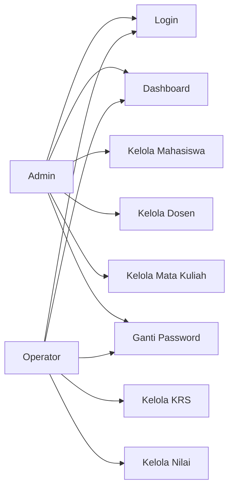

### Alur kerja Admin

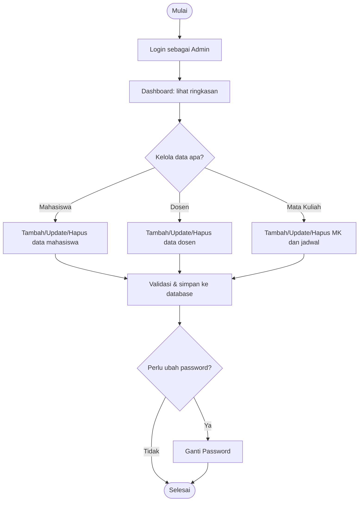

### Alur kerja Operator

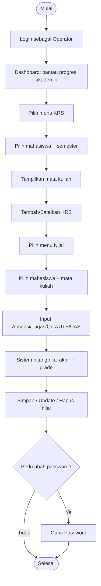

## Skema Visual Database

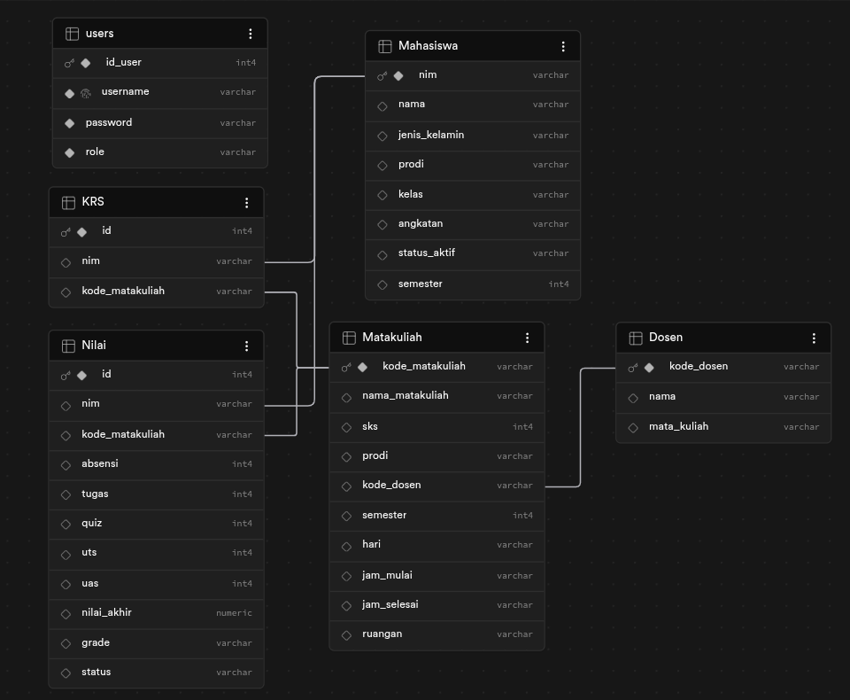

Relasi utama:
- `Mahasiswa` terhubung ke `KRS` dan `Nilai` lewat `nim`.
- `Matakuliah` terhubung ke `KRS` dan `Nilai` lewat `kode_matakuliah`.
- `Dosen` terhubung ke `Matakuliah` lewat `kode_dosen`.
- `users` dipakai untuk autentikasi dan role (`Admin` / `Operator`).

## Penjelasan Visual Dashboard

Di halaman Dashboard, ringkasan dan chart diambil langsung dari data database:

- **Kartu statistik:** Total Mahasiswa, Sudah KRS, Belum KRS, Rata-rata Grade.
- **Filter jurusan:** memilih prodi tertentu atau `SEMUA`.
- **Chart 1:** *Stacked Bar* pendaftaran KRS per departemen (sudah/belum KRS).
- **Chart 2:** *Donut Chart* distribusi grade akademik (A/B/C/D).

Implementasi visual menggunakan:
- **Java Swing + Java2D custom rendering** (tanpa library chart eksternal).
- Komponen chart ada di `uts1/src/uts1/ui/ChartComponents.java`:
  - `ChartComponents.StackedBarChart`
  - `ChartComponents.DonutChart`
- Data dashboard dihitung di `uts1/src/uts1/MainMenu.java` pada metode `fetchDashboardStats(...)`.

## Screenshot Aplikasi

### 1) Login Page
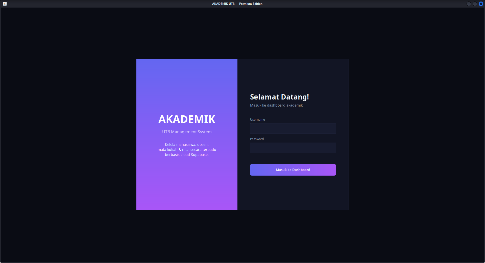
**Penjelasan:** Halaman autentikasi awal. User memasukkan username & password untuk masuk ke sistem bisa menggunakan kredensial default dibawah ini.

| username | password |
|---|---|
| **admin** | admin123 |
| **operator** | operator123 |

**Output:** Jika valid, sistem membaca role dan menampilkan menu sesuai hak akses.

### 2) Dashboard Page (Admin)
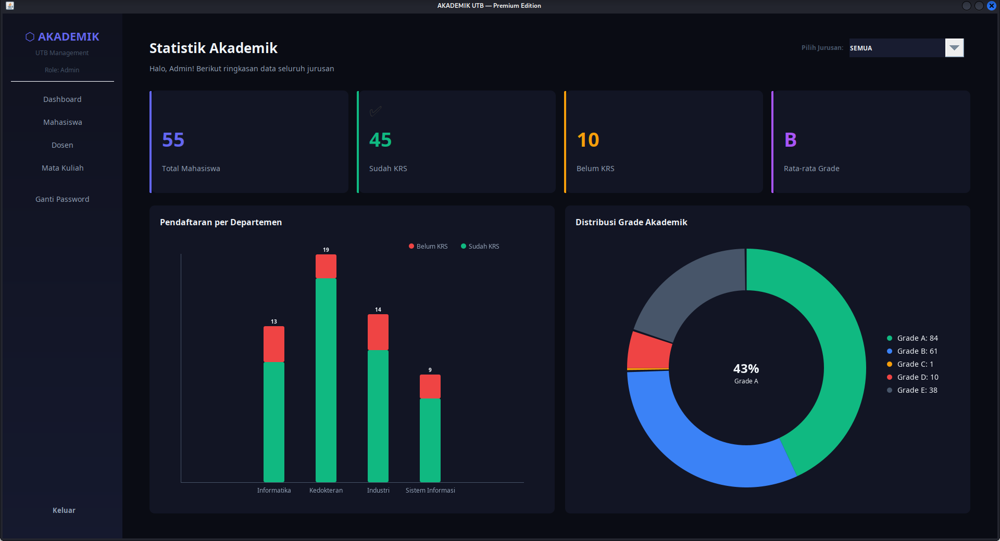
**Penjelasan:** Ringkasan kondisi akademik secara real-time.  
**Informasi utama:** total mahasiswa, status KRS (sudah/belum), rata-rata grade, visual bar + donut chart, dan filter jurusan.

### 3) Mahasiswa Page (Admin)
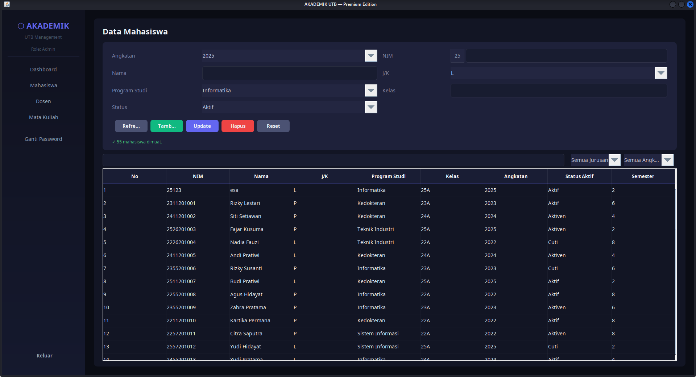
**Penjelasan:** Modul CRUD data mahasiswa (NIM, nama, prodi, kelas, angkatan, semester).  
**Aksi:** `Refresh`, `Tambah`, `Update`, `Hapus`, `Reset`, dan pencarian data.

### 4) Dosen Page (Admin)
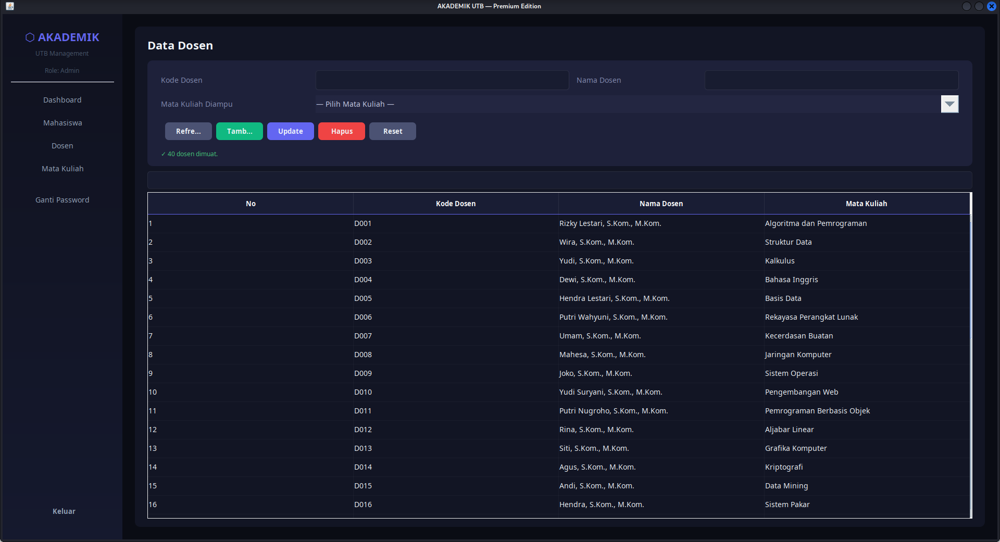
**Penjelasan:** Modul CRUD data dosen dan pemetaan mata kuliah yang diampu.  
**Aksi:** `Refresh`, `Tambah`, `Update`, `Hapus`, `Reset`, dan pencarian.

### 5) Mata Kuliah Page (Admin)
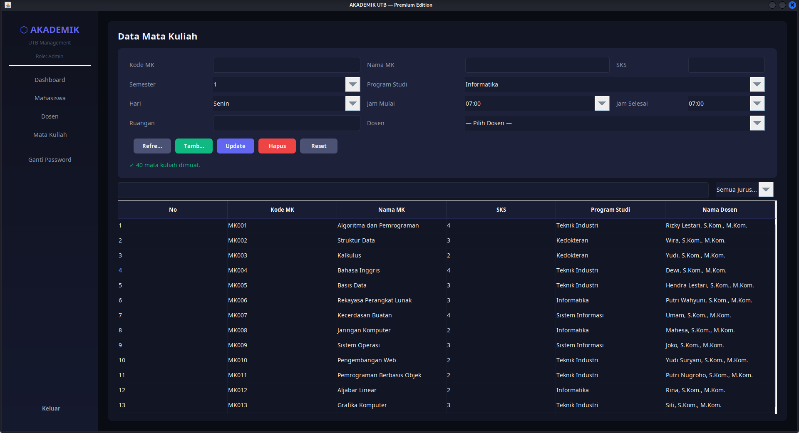
**Penjelasan:** Modul CRUD data mata kuliah dan jadwal (SKS, dosen, semester, hari, jam, ruangan).  
**Aksi:** `Refresh`, `Tambah`, `Update`, `Hapus`, `Reset`, serta filter/pencarian.

### 6) Ganti Password Page
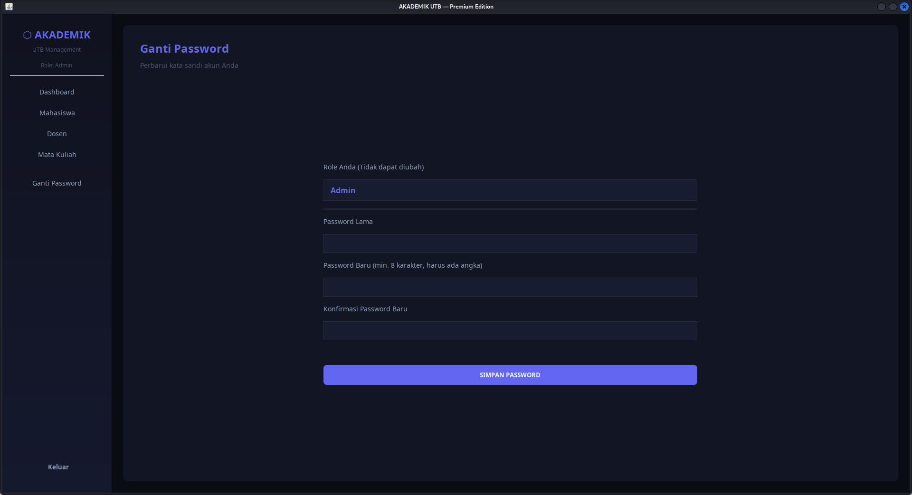
**Penjelasan:** Fitur keamanan akun untuk mengganti password user yang sedang login.  
**Aksi:** Verifikasi password lama dan simpan password baru.

### 7) KRS Page (Operator)
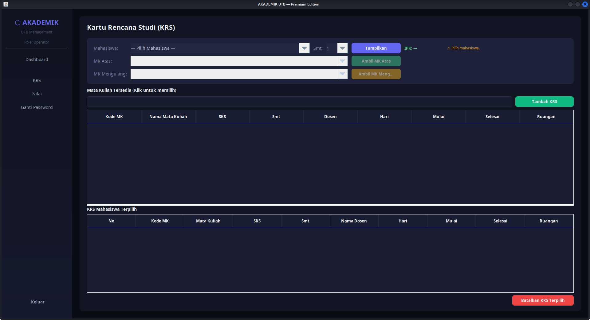
**Penjelasan:** Pengelolaan Kartu Rencana Studi per mahasiswa dan semester.  
**Aksi:** pilih mahasiswa+semester, tampilkan mata kuliah, tambah KRS, batalkan KRS, ambil MK atas/mengulang jika memenuhi syarat.

### 8) Nilai Page (Operator)
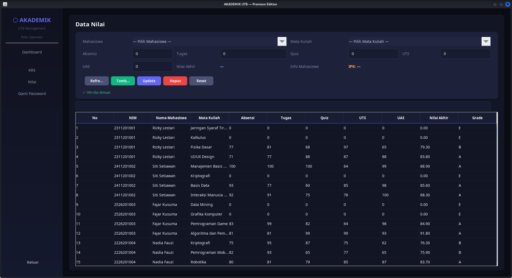
**Penjelasan:** Input dan manajemen nilai akademik per mahasiswa dan mata kuliah.  
**Aksi:** isi komponen nilai (absensi, tugas, quiz, UTS, UAS), hitung otomatis nilai akhir+grade, lalu `Tambah`, `Update`, `Hapus`, dan filter grade.
