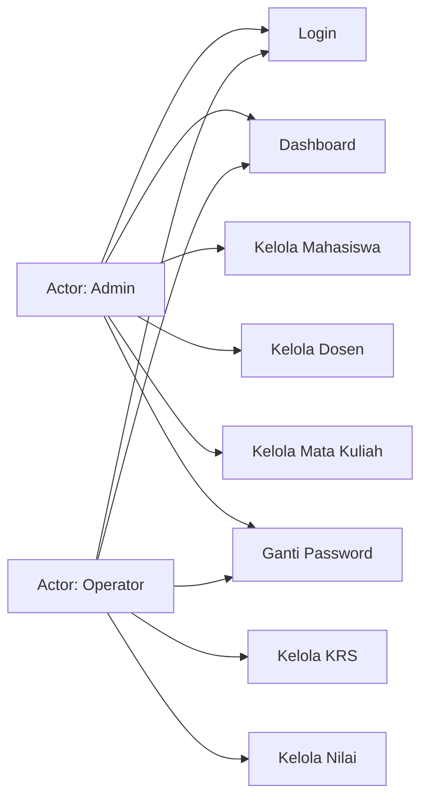
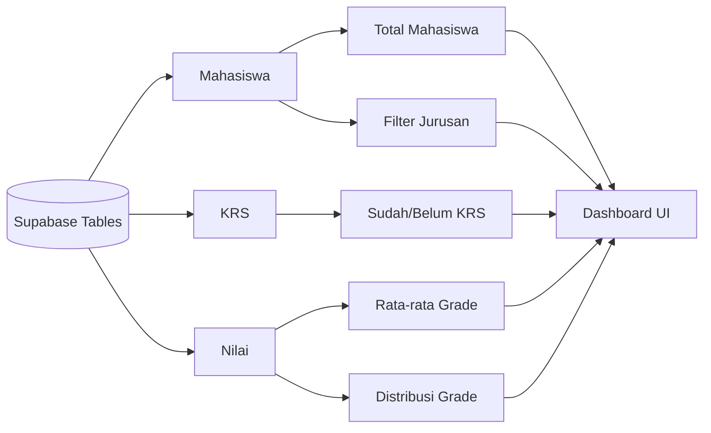

# Use Case & Alur Kerja UTS_PBO2 (Visual)

Dokumen ini menyajikan use case dan alur kerja utama aplikasi dalam bentuk visual (Mermaid) agar mudah dipahami di halaman GitHub.

## 1) Use Case Utama

## 2) Activity Flow Admin

## 3) Activity Flow Operator

## 4) Data Flow Ringkas Dashboard

## 5) Catatan Implementasi Visual

- UI dibangun dengan **Java Swing**.
- Visualisasi dashboard memakai **custom Java2D drawing** (tanpa chart library eksternal):
  - `ChartComponents.StackedBarChart`
  - `ChartComponents.DonutChart`
- Perhitungan data dashboard berada di `MainMenu.fetchDashboardStats(...)`.

