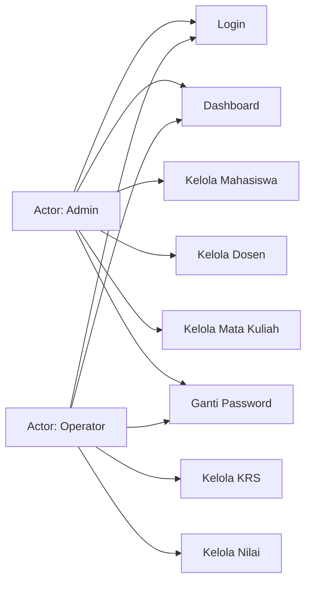
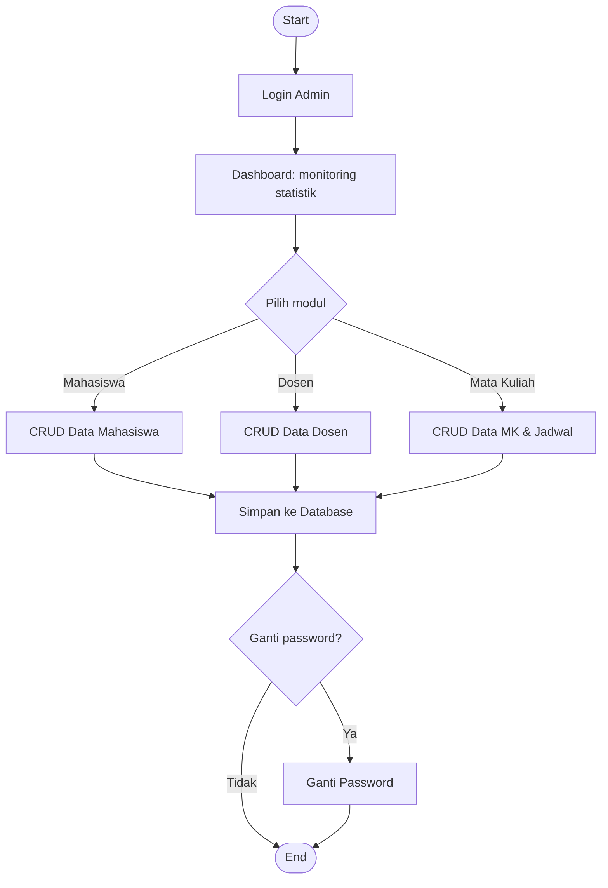
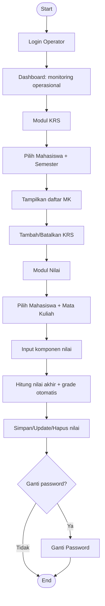
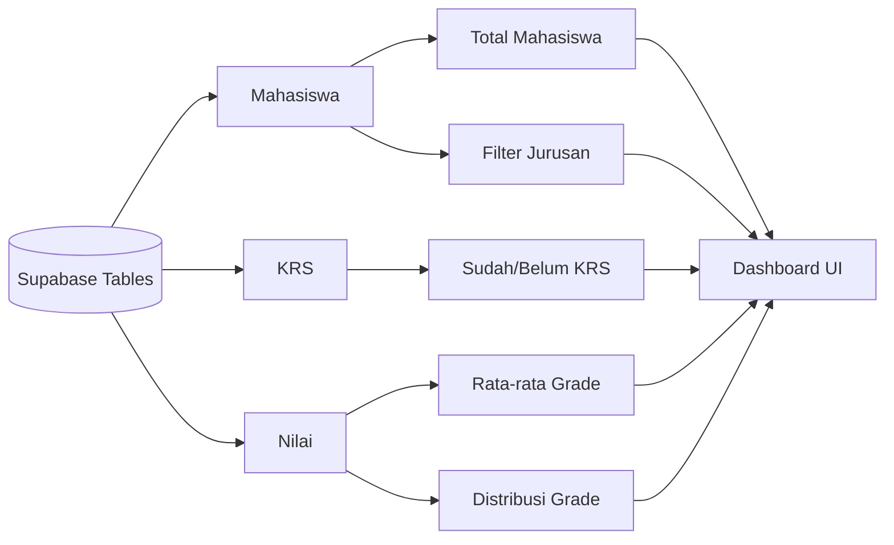

# Use Case & Alur Kerja UTS_PBO2 (Visual + Skenario)

Dokumen ini berisi:
1. Visual use case.
2. Visual alur kerja (activity flow).
3. Penjelasan tiap alur langkah demi langkah.
4. Skenario use case (precondition, alur utama, alternatif, postcondition).

---

## 1) Use Case Utama (Visual)

### Penjelasan Use Case

- **Admin** berfokus pada pengelolaan data master: Mahasiswa, Dosen, dan Mata Kuliah.
- **Operator** berfokus pada proses akademik: KRS dan Nilai.
- **Keduanya** memiliki akses ke Dashboard dan Ganti Password.

---

## 2) Activity Flow Admin (Visual)

### Penjelasan Alur Admin

1. Admin login dengan kredensial valid.
2. Sistem menampilkan dashboard ringkasan data akademik.
3. Admin memilih modul data master yang ingin dikelola.
4. Admin melakukan aksi CRUD (Tambah, Update, Hapus, Refresh, Reset).
5. Perubahan disimpan ke database Supabase.
6. Opsional: admin mengganti password akun.
7. Proses selesai / logout.

---

## 3) Activity Flow Operator (Visual)

### Penjelasan Alur Operator

1. Operator login ke sistem.
2. Operator melihat dashboard untuk memantau progres.
3. Di menu KRS, operator memilih mahasiswa dan semester.
4. Operator menambah atau membatalkan KRS sesuai kebutuhan.
5. Di menu Nilai, operator mengisi komponen nilai akademik.
6. Sistem menghitung nilai akhir dan grade secara otomatis.
7. Operator menyimpan/update/hapus data nilai.
8. Opsional: operator mengganti password akun.

---

## 4) Data Flow Ringkas Dashboard (Visual)

### Penjelasan Data Flow Dashboard

1. Sistem mengambil data dari tabel `Mahasiswa`, `KRS`, dan `Nilai`.
2. Data dihitung menjadi indikator (total mahasiswa, status KRS, rata-rata grade).
3. Distribusi grade dipetakan menjadi donut chart.
4. Status KRS per jurusan dipetakan menjadi stacked bar chart.
5. Hasil perhitungan ditampilkan ke kartu statistik dan chart dashboard.

---

## 5) Skenario Use Case (Detail)

### UC-01 Login

| Item | Deskripsi |
|---|---|
| Aktor | Admin, Operator |
| Tujuan | Masuk ke sistem sesuai role |
| Precondition | Akun tersedia di tabel `users` |
| Trigger | User klik tombol **Masuk ke Dashboard** |
| Alur Utama | 1) Input username/password → 2) Sistem validasi ke `users` → 3) Role ditemukan → 4) Dashboard tampil |
| Alur Alternatif | Kredensial salah / koneksi gagal → tampil pesan error |
| Postcondition | Sesi login aktif, menu tampil sesuai role |

### UC-02 Lihat Dashboard

| Item | Deskripsi |
|---|---|
| Aktor | Admin, Operator |
| Tujuan | Melihat ringkasan kondisi akademik |
| Precondition | User sudah login |
| Trigger | User masuk ke halaman Dashboard |
| Alur Utama | 1) Sistem ambil data Mahasiswa/KRS/Nilai → 2) Hitung KPI → 3) Render kartu statistik + chart |
| Alur Alternatif | Data kosong → nilai statistik default 0 |
| Postcondition | Dashboard terbarui sesuai data terbaru |

### UC-03 Kelola Mahasiswa

| Item | Deskripsi |
|---|---|
| Aktor | Admin |
| Tujuan | Menambah, mengubah, menghapus data mahasiswa |
| Precondition | Admin login |
| Trigger | Admin pilih menu **Mahasiswa** |
| Alur Utama | 1) Isi form → 2) Pilih aksi (Tambah/Update/Hapus) → 3) Sistem validasi → 4) Simpan perubahan |
| Alur Alternatif | Data tidak valid / konflik relasi saat hapus |
| Postcondition | Data mahasiswa terbarui |

### UC-04 Kelola Dosen

| Item | Deskripsi |
|---|---|
| Aktor | Admin |
| Tujuan | Menjaga data dosen tetap akurat |
| Precondition | Admin login |
| Trigger | Admin buka menu **Dosen** |
| Alur Utama | CRUD data dosen lalu simpan |
| Alur Alternatif | Hapus gagal karena masih dipakai relasi mata kuliah |
| Postcondition | Data dosen terbarui |

### UC-05 Kelola Mata Kuliah

| Item | Deskripsi |
|---|---|
| Aktor | Admin |
| Tujuan | Mengelola data mata kuliah dan jadwal |
| Precondition | Admin login, data dosen tersedia |
| Trigger | Admin buka menu **Mata Kuliah** |
| Alur Utama | Isi kode/nama/SKS/prodi/dosen/jadwal → simpan |
| Alur Alternatif | Validasi gagal (field wajib kosong / format salah) |
| Postcondition | Data mata kuliah dan jadwal terbarui |

### UC-06 Kelola KRS

| Item | Deskripsi |
|---|---|
| Aktor | Operator |
| Tujuan | Menetapkan mata kuliah yang diambil mahasiswa per semester |
| Precondition | Operator login, data mahasiswa & matakuliah tersedia |
| Trigger | Operator buka menu **KRS** |
| Alur Utama | 1) Pilih mahasiswa+semester → 2) Tampilkan MK → 3) Tambah KRS / Batalkan KRS |
| Alur Alternatif | MK tidak tersedia / data duplikat / aturan akademik tidak terpenuhi |
| Postcondition | Data KRS mahasiswa terbarui |

### UC-07 Kelola Nilai

| Item | Deskripsi |
|---|---|
| Aktor | Operator |
| Tujuan | Menginput dan memelihara nilai mahasiswa |
| Precondition | Operator login, data KRS/mata kuliah tersedia |
| Trigger | Operator buka menu **Nilai** |
| Alur Utama | 1) Pilih mahasiswa+MK → 2) Isi komponen nilai → 3) Sistem hitung nilai akhir+grade → 4) Simpan |
| Alur Alternatif | Input tidak valid / data belum lengkap |
| Postcondition | Data nilai terbarui dan siap dipantau di dashboard |

### UC-08 Ganti Password

| Item | Deskripsi |
|---|---|
| Aktor | Admin, Operator |
| Tujuan | Menjaga keamanan akun |
| Precondition | User login |
| Trigger | User buka menu **Ganti Password** |
| Alur Utama | 1) Isi password lama & baru → 2) Sistem verifikasi → 3) Password diperbarui |
| Alur Alternatif | Password lama salah / password baru tidak valid |
| Postcondition | Password akun berhasil diganti |

---

## 6) Catatan Implementasi Visual

- UI dibangun dengan **Java Swing**.
- Visualisasi dashboard memakai **custom Java2D drawing** (tanpa chart library eksternal):
  - `ChartComponents.StackedBarChart`
  - `ChartComponents.DonutChart`
- Perhitungan data dashboard berada di `MainMenu.fetchDashboardStats(...)`.

